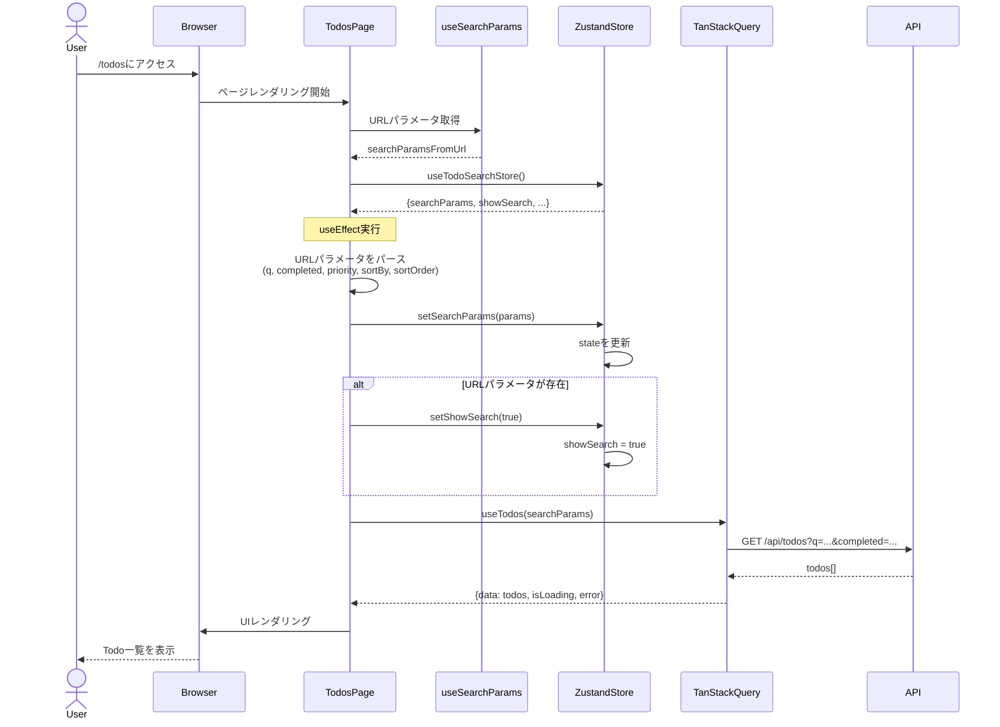
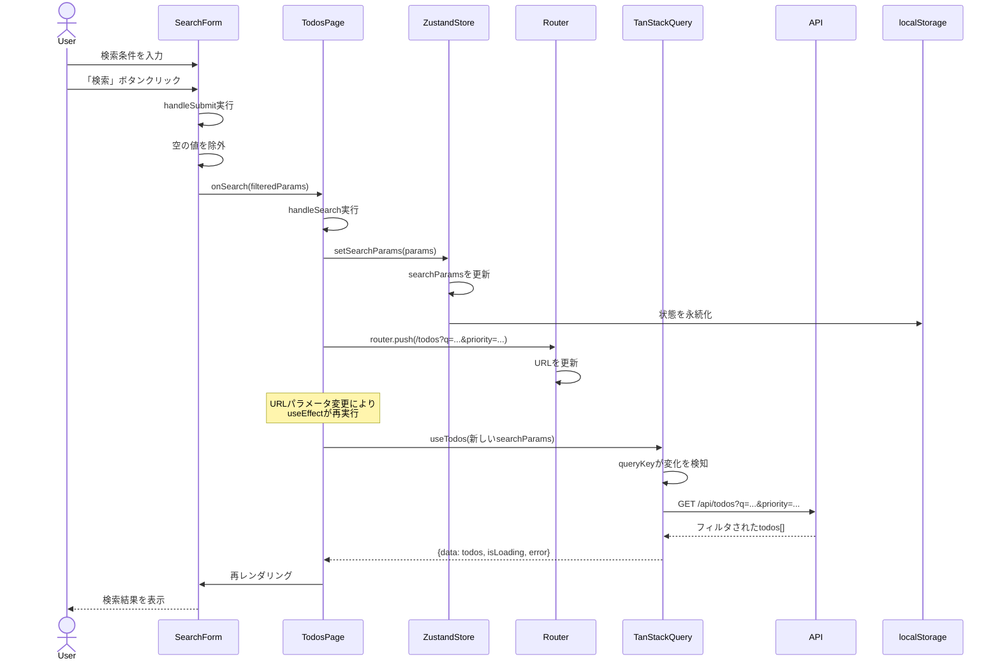
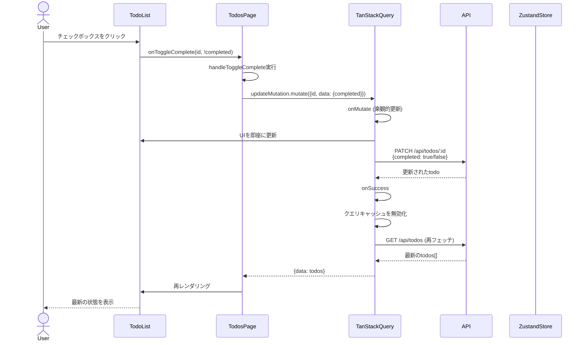
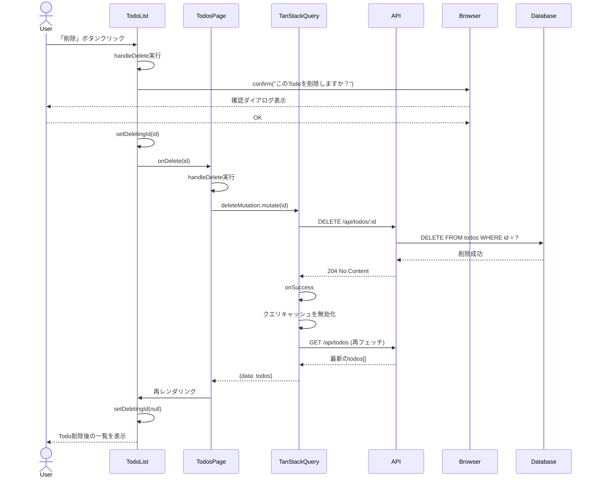
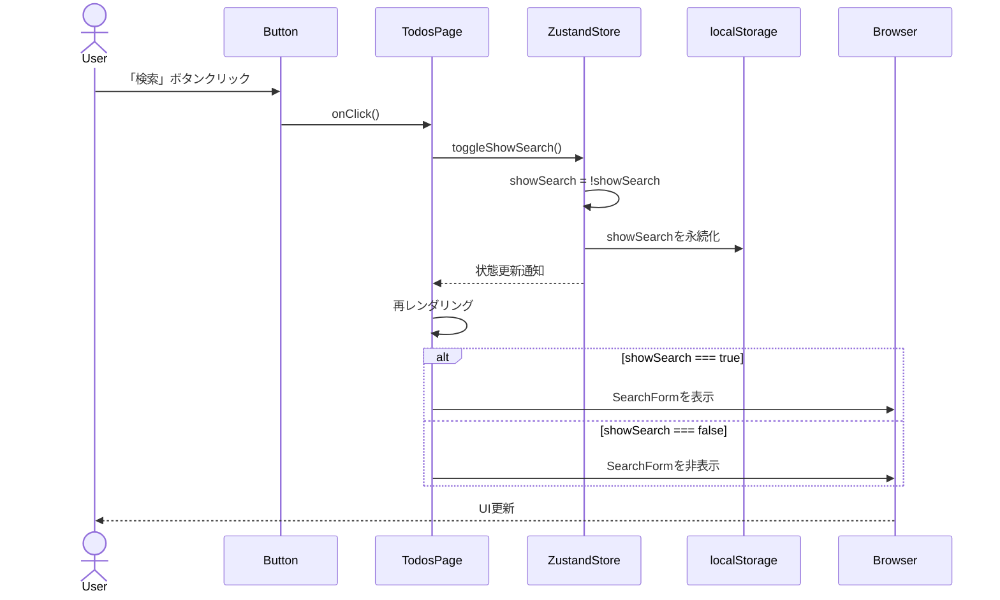

# Todosページのシーケンス図

## 1. 初期ロード時の流れ



## 2. 検索実行時の流れ



## 3. Todo完了トグル時の流れ



## 4. Todo削除時の流れ



## 5. 検索フォーム表示/非表示トグル時の流れ



## データフローの概要

```
┌─────────────────────────────────────────────────────────────┐
│                         TodosPage                            │
│                                                               │
│  ┌──────────────┐         ┌──────────────┐                  │
│  │  URL Params  │────────▶│   Zustand    │                  │
│  │ (useSearch   │         │    Store     │                  │
│  │   Params)    │         │              │                  │
│  └──────────────┘         └──────┬───────┘                  │
│         │                        │                           │
│         │                        ▼                           │
│         │              ┌──────────────────┐                  │
│         └─────────────▶│  searchParams    │                  │
│                        │   (state)        │                  │
│                        └────────┬─────────┘                  │
│                                 │                            │
│                                 ▼                            │
│                        ┌──────────────────┐                  │
│                        │  TanStack Query  │                  │
│                        │   useTodos()     │                  │
│                        └────────┬─────────┘                  │
│                                 │                            │
│                                 ▼                            │
│                        ┌──────────────────┐                  │
│                        │   API Endpoint   │                  │
│                        │  /api/todos      │                  │
│                        └────────┬─────────┘                  │
│                                 │                            │
│                                 ▼                            │
│                        ┌──────────────────┐                  │
│                        │    Database      │                  │
│                        │   (JSON File)    │                  │
│                        └──────────────────┘                  │
└─────────────────────────────────────────────────────────────┘
```

## 状態管理の役割分担

| 技術 | 役割 | 例 |
|------|------|-----|
| **Zustand** | クライアント側のUI状態管理 | `searchParams`, `showSearch` |
| **TanStack Query** | サーバー状態管理（キャッシュ、同期） | `todos[]`, `isLoading`, `error` |
| **URL Params** | 共有可能な状態、ブラウザ履歴 | `/todos?q=test&priority=high` |
| **localStorage** | 永続化されたUI状態 | `showSearch`の保存 |

## キーポイント

1. **Zustand**: UI状態（検索パラメータ、検索フォーム表示）をグローバル管理
2. **TanStack Query**: サーバーデータの取得・キャッシュ・同期を自動化
3. **URL同期**: 検索条件をURLに反映し、リロードやシェア可能に
4. **楽観的更新**: UI即座更新→API呼び出し→確認の順で実行
5. **自動再フェッチ**: mutationが成功したらクエリを自動的に再取得
